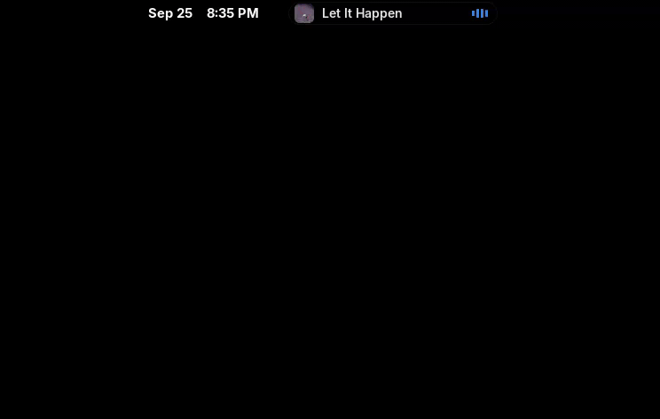

# Island

A Dynamic Island for GNOME Shell 50: one black pill at the top of the screen
for media, the time and notifications.

- **Media:** while something plays, the pill shows the cover, title and a
  little equalizer. Hover it (or click it) and it grows into a full player:
  album art, title, artist and album, a seekable progress bar, previous /
  play-pause / next, ±N second seek, shuffle, repeat and a switcher when
  several players are running. Middle-click the pill to play/pause.
- **Time:** placed inside the top bar, the pill shows the time in place of
  GNOME's clock while it is visible.
- **Notifications:** incoming notifications open the island into a card with
  the app, title, message and action buttons, then shrink back after a few
  seconds. Click the card to open it; urgent ones stay until dismissed.

It hides when there is nothing to show.



## Files

| File | What it does |
| --- | --- |
| `metadata.json` | Extension id, name, supported shell versions |
| `extension.js` | Entry point: `enable()` builds everything, `disable()` tears it down |
| `mpris.js` | Talks to media players over D-Bus (MPRIS), picks the current player |
| `island.js` | The UI: compact pill, expanded card, animations |
| `art.js` | Turns cover URLs into local files (downloads remote covers to `~/.cache/island`) |
| `stylesheet.css` | All styling |
| `prefs.js` | Settings window (GTK4 + libadwaita, runs outside the shell) |
| `schemas/` | GSettings schema for the settings and shortcuts |
| `tools/mock-player.js` | Fake MPRIS player for testing |

## Develop

```sh
make install        # symlink this folder into ~/.local/share/gnome-shell/extensions
make enable         # add it to the enabled list
```

On Wayland the running shell only notices new extensions after you log out and
back in. For quicker loops, run a nested shell in a window:

```sh
sudo dnf install mutter-devkit   # once
make nested
```

Other targets:

```sh
make mock ARGS='spotify "Some Song" "Some Artist"'   # fake player
make logs                                            # shell log, errors show here
make pack                                            # zip for extensions.gnome.org
gnome-extensions prefs island@k44z                   # settings window
```

## Default shortcuts

| Action | Keys |
| --- | --- |
| Expand / collapse | Super+Ctrl+M |
| Play / pause | Super+Ctrl+Space |
| Previous / next track | Super+Ctrl+, / Super+Ctrl+. |
| Seek back / forward | Super+Ctrl+← / Super+Ctrl+→ |
| Switch player | Super+Ctrl+P |

All of them can be changed in the settings window.
